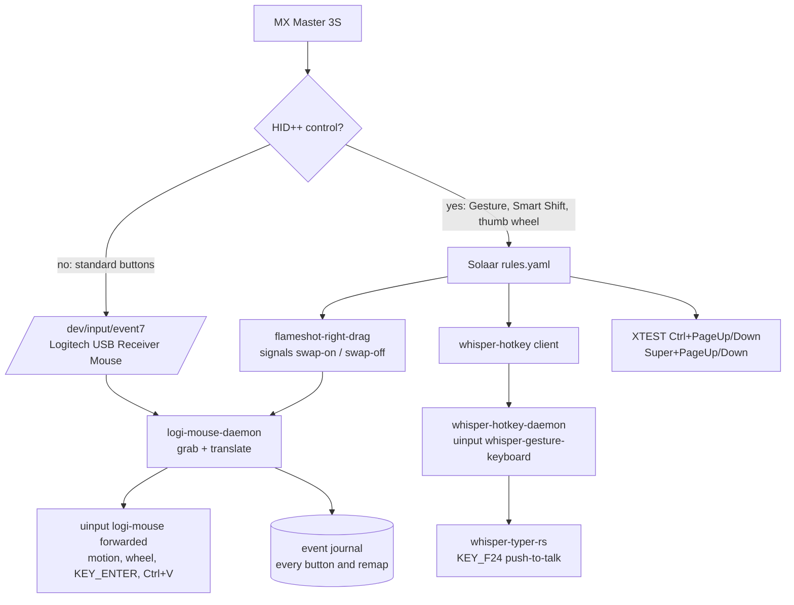

# MX Master 3S input stack

Every mouse control on this workstation is configured from files in this repo.
This document is the authoritative record: what owns each control, which files
are deployed where, how to verify them, and how to recover the known failure
modes. `docs/SOLAAR_MOUSE_SETUP.md` is the short operational summary.

## Current stage

Stage 1 is deployed: `logi-mouse-daemon` (this repo, `src/bin/logi_mouse_daemon.rs`)
owns the receiver's mouse node. It replaces Input Remapper for this mouse and
absorbs what used to be two extra scripts.

| Control | Owner | Implemented as |
|---|---|---|
| left, right, middle | `logi-mouse-daemon` | forwarded unchanged (left/right swapped only while a screenshot overlay is open) |
| Back | `logi-mouse-daemon` | `KEY_ENTER` — submit |
| Forward | `logi-mouse-daemon` | `Ctrl` + the key that types `v` — paste |
| Gesture button | Solaar + `whisper-hotkey-daemon` | diverted in HID++, press/release become `KEY_F24` push-to-talk |
| Smart Shift | Solaar rule | runs `flameshot-right-drag` |
| thumb wheel | Solaar rules | `Ctrl+PageUp/Down`, `Super+PageUp/Down` |
| main wheel | kernel | free-spinning, plain `REL_WHEEL` |

Input Remapper is still installed and its preset is still on disk, but its
autoload entry was removed and injection is stopped, so it can no longer grab
the mouse. Solaar stays because it is the only thing here that speaks HID++.

## Architecture



Two invariants come from that diagram:

1. A diverted button never reaches the event node, so the daemon cannot see it.
   Back and Forward must stay **regular** in Solaar.
2. `KEY_F24` has exactly one producer — the gesture daemon. A second producer
   (a Solaar paste rule, or a mouse mapping that emits `KEY_F24`) makes one press
   emit two hotkeys and dictation flaps. The daemon emits no `KEY_F24` at all.

`whisper-hotkey-daemon` disables only its dedicated `whisper-gesture-keyboard`
in X. Whisper Typer reads that device directly through evdev, so press/release
still activate dictation while desktop apps receive no F24. This avoids
Terminator's hide-pointer-on-keypress behavior and held-key flicker. The guard
runs at start-up, before each press, and on a five-second idle tick so it recovers
after X/device changes. If X isolation cannot be applied, `xset -r 202` prevents
F24 auto-repeat as a fallback. `whisper-f24-no-repeat.service` still applies that
repeat setting once at session start.

## The daemon

`src/bin/logi_mouse_daemon.rs`, installed as `~/.local/bin/logi-mouse-daemon`
and run by `logi-mouse-daemon.service`.

What it does:

* finds the device named `Logitech USB Receiver Mouse` (or `--source-path`),
  repairs the raw node's X button state, grabs the node, then creates a uinput
  mouse mirroring the source capabilities plus `KEY_ENTER`, `KEY_LEFTCTRL` and
  the paste key;
* translates events with `translate()`, a pure function with unit tests:
  Back -> `KEY_ENTER`, Forward -> `Ctrl` + paste key, left/right swapped while
  screenshot mode is active, everything else passed through. A release always
  matches whatever was pressed even if the swap flipped mid-press;
* resolves the paste key from the live X keymap (`xmodmap -pke`) so a Dvorak
  layout pastes the right character — keycode 52 on this machine — with
  `--paste-keycode` as an override;
* serves `/run/user/<uid>/logi-mouse.sock` for `swap-on`, `swap-off`, `status`;
  screenshot mode expires by itself after `--swap-timeout` seconds;
* journals every button and wheel event plus every remap decision to
  `~/.whisper-typer-history/mouse/YYYY-MM-DD.jsonl`, with `--trace-motion` for
  relative motion as well;
* on session end releases any button it still holds, drops the sink, ungrabs and
  re-runs the X hygiene pass; on start it retries every second until the
  receiver is present and recovers from disconnects.

### Debugging from the journal

```bash
tail -f ~/.whisper-typer-history/mouse/$(date +%F).jsonl
```

Each line carries `kind` (`key`, `wheel`, `motion`, `state`), the raw code, the
value, the action (`passthrough`, `remap`, `suppressed`) and the emitted events,
so a control that misbehaves can be reconstructed exactly:

```json
{"kind":"key","code":"BTN_SIDE(back)","code_raw":275,"value":1,"action":"remap","out":["KEY_ENTER+"]}
```

## Deployed artifacts

| Repo source | Installed path |
|---|---|
| `src/bin/logi_mouse_daemon.rs` (built) | `~/.local/bin/logi-mouse-daemon` |
| `infra/flameshot-right-drag` | `~/.local/bin/flameshot-right-drag` |
| `infra/mouse-button-guard` | `~/.local/bin/mouse-button-guard` |
| `infra/whisper-hotkey.py` | `~/.local/bin/whisper-hotkey` |
| `infra/whisper-hotkey-daemon.py` | `~/.local/bin/whisper-hotkey-daemon` |
| `infra/solaar/rules.yaml` | `~/.config/solaar/rules.yaml` |
| `infra/systemd/logi-mouse-daemon.service` | `~/.config/systemd/user/logi-mouse-daemon.service` |
| `infra/systemd/mouse-button-guard.service` | `~/.config/systemd/user/mouse-button-guard.service` |
| `infra/systemd/whisper-hotkey-daemon.service` | `~/.config/systemd/user/whisper-hotkey-daemon.service` |
| `infra/systemd/app-solaar@autostart.service.d/restart.conf` | `~/.config/systemd/user/app-solaar@autostart.service.d/restart.conf` |
| `infra/input-remapper/Whisper mouse.json` | Input Remapper preset, kept on disk but no longer autoloaded |

Solaar's own keyed settings live in `~/.config/solaar/config.yaml`; the expected
values are recorded in `infra/solaar/mx-master-3s-settings.yaml`.

```bash
infra/install-mouse-stack.sh     # idempotent deploy (builds the daemon)
infra/verify-mouse-stack.sh      # read-only, exits non-zero on drift
```

## Tests

```bash
cargo test --bin logi-mouse-daemon     # translation unit tests
infra/test-logi-mouse-daemon.py        # end-to-end against synthetic uinput devices
```

The integration test builds a fake mouse, runs the daemon against it, and checks
the translated output for Back, Forward, passthrough, the screenshot swap and the
journal. It disables its own synthetic pointer in X, so it is safe to run while
working; it never touches the real receiver.

## Solaar side (unchanged in stage 1)

```yaml
scroll-ratchet: freespinning
smart-shift: 1
divert-keys: {0x52: 0x0, 0x53: 0x0, 0x56: 0x0, 0xc3: 0x1, 0xc4: 0x1}
reprogrammable-keys: {0x50: 0x50, 0x51: 0x51, 0x52: 0x52, 0x53: 0x53, 0x56: 0x56, 0xc3: 195, 0xc4: 0xc4}
thumb-scroll-mode: true
```

`infra/solaar/rules.yaml` maps Smart Shift to `flameshot-right-drag`, the gesture
button to `whisper-hotkey press|release`, and the thumb wheel to page navigation.
There is deliberately no Forward rule: the daemon owns that button.

> Solaar 1.1.11 note: `solaar config "<device>" divert-keys "<key>"` used as a
> read-only query can serialize the keyed setting as a scalar and corrupt the
> persisted map. Read state with `solaar show`; change keyed settings by editing
> `config.yaml` and restarting Solaar.

## Recovery runbook

| Symptom | Cause | Fix |
|---|---|---|
| Pointer moves, wheels work, clicks dead | stale button-down on the grabbed raw node | `systemctl --user restart logi-mouse-daemon` (its start-up hygiene repairs it); `mouse-button-guard` also clears it within seconds |
| Gesture button does not dictate after USB glitch | receiver reset dropped HID++ diversion; Solaar descriptors stale | `mouse-button-guard` automatically detects the reconnect and restarts Solaar within 2s; manual fix: `systemctl --user restart app-solaar@autostart.service` |
| Solaar exited or killed | process failure | `app-solaar@autostart.service.d/restart.conf` automatically restarts it within 2s; `mouse-button-guard` also enforces active state |
| Nothing moves at all | daemon cannot open or read the device | `journalctl --user -u logi-mouse-daemon -n 50`; the journal records `source_device_not_available` style info messages |
| Screenshot selects with the wrong button | swap flag left on | `~/.local/bin/logi-mouse-daemon --control swap-off`; the flag also expires on its own |
| Gesture button dictates twice | a second `KEY_F24` producer appeared | confirm no Solaar Forward rule and that the daemon emits no `KEY_F24` |
| Holding gesture flickers the cursor or the focused app | X auto-repeat got re-enabled for `F24` (keymap reload) | `systemctl --user restart whisper-hotkey-daemon`; it re-asserts `xset -r 202` on start-up, per press and every 5s |
| Paste lands as another letter | keymap changed under the daemon | restart the daemon; it re-reads the X keymap, or pin `--paste-keycode` |
| Gesture and Forward do the same thing | firmware alias `0xc3 → 0x56` | restore `reprogrammable-keys` `0xc3: 195` |
| Daemon gone, mouse behaves as stock | unit stopped or crashed repeatedly | `systemctl --user status logi-mouse-daemon`; the raw node keeps working, just without remaps |

## Rolling back to Input Remapper

```bash
systemctl --user stop logi-mouse-daemon
cp ~/.config/input-remapper-2/config.json.pre-logi-mouse ~/.config/input-remapper-2/config.json
input-remapper-control --command autoload
```

The installer keeps that backup the first time it clears the autoload map.

## Roadmap

* **Stage 2** — fold the HID++ side into the daemon so the gesture button and
  Smart Shift no longer need Solaar rules, the `whisper-hotkey` socket client and
  the separate `whisper-hotkey-daemon`. Either reuse Solaar's Python library
  (`/usr/share/solaar/lib`, verified importable) or implement the small feature
  subset (`0x1B04` divert plus notifications). This retires four moving parts.
* **Stage 3** — retire Input Remapper and the guard entirely, and decide whether
  to keep Solaar for battery/tray display only. Optionally make the exotic
  buttons emit ordinary evdev codes once via firmware configuration so no HID++
  client is needed at runtime (needs verification on this firmware).

## Change log

2026-09-24:

1. Auto-healing supervisor added to `infra/mouse-button-guard`:
   - Detects USB receiver disconnect/reconnect and device ID re-enumeration; automatically
     restarts Solaar within 2 seconds so fresh `/dev/hidraw1` descriptors are opened and
     HID++ button diversions (`0xc3` gesture, `0xc4` smart shift) are freshly re-applied.
   - Supervises process and socket liveness every 10 seconds: ensures `app-solaar@autostart`,
     `whisper-hotkey-daemon`, `logi-mouse-daemon`, and `whisper-typer-rs` remain active, and
     terminates rogue unmanaged GNOME scopes.
   - Non-blocking 5-minute background health check verifying active gesture diversion in Solaar.
2. Systemd drop-in override added at `infra/systemd/app-solaar@autostart.service.d/restart.conf`:
   configures `Restart=always` and `RestartSec=2` so Solaar restarts automatically if it ever crashes.
3. Updated `infra/install-mouse-stack.sh` and `infra/verify-mouse-stack.sh` (29/29 checks passing).

2026-09-14:

1. Gesture dictation moved off the old Forward bridge: gesture is again
   "Gesture Button Navigation", Solaar diverts it, and `whisper-hotkey-daemon`
   turns press/release into `KEY_F24`.
2. Side buttons moved to Input Remapper (`275 → KEY_ENTER`,
   `276 → Control_L + v`), removing the Solaar Forward rule and the double-paste
   and double-`F24` paths. Backups of the earlier configuration are in git.
3. Stage 1 daemon built and deployed: it now owns the mouse node, so Input
   Remapper no longer injects. The screenshot swap moved inside the daemon, and
   the X-state hygiene that used to be an external guard now runs at every
   session boundary.
4. Event journal added for forensics.
