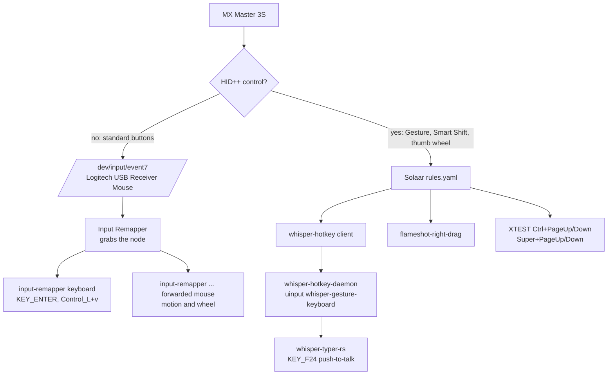

# MX Master 3S input stack

Every mouse control on this workstation is configured from files in this repo.
This document is the authoritative record of the stack: what owns each control,
which files are deployed where, how to verify it, and how to recover the known
failure modes. `docs/SOLAAR_MOUSE_SETUP.md` is the short operational summary.

## Ownership

Two programs share the MX Master 3S, and each control belongs to exactly one of
them:

| Owner | Controls | Why |
|---|---|---|
| Input Remapper | left, right, middle, Back, Forward | these already emit standard evdev codes, so they can be remapped normally |
| Solaar | Gesture button, Smart Shift button, thumb wheel | the firmware exposes these only as HID++ controls (diversion), never on the event node |

`Back → KEY_ENTER` (submit) and `Forward → Control_L + v` (paste) are Input
Remapper's. The gesture button is Solaar's, and it reaches Whisper Typer through
the `whisper-hotkey-daemon` bridge rather than through Input Remapper.

## Event chain



Two invariants follow from this diagram and are worth stating explicitly:

1. A diverted button never reaches the event node, so Input Remapper cannot map
   it. Back and Forward must stay **regular** in Solaar for their remaps to work.
2. `KEY_F24` has exactly one producer — the gesture daemon. A second producer
   (a Solaar paste rule, or a stale Input Remapper mapping to `KEY_F24`) makes
   one button press emit two hotkeys and dictation flaps.

## Deployed artifacts

| Repo source | Installed path |
|---|---|
| `infra/flameshot-right-drag` | `~/.local/bin/flameshot-right-drag` |
| `infra/mouse-button-guard` | `~/.local/bin/mouse-button-guard` |
| `infra/whisper-hotkey.py` | `~/.local/bin/whisper-hotkey` |
| `infra/whisper-hotkey-daemon.py` | `~/.local/bin/whisper-hotkey-daemon` |
| `infra/solaar/rules.yaml` | `~/.config/solaar/rules.yaml` |
| `infra/input-remapper/Whisper mouse.json` | `~/.config/input-remapper-2/presets/Logitech USB Receiver/Whisper mouse.json` |
| `infra/systemd/whisper-hotkey-daemon.service` | `~/.config/systemd/user/whisper-hotkey-daemon.service` |
| `infra/systemd/mouse-button-guard.service` | `~/.config/systemd/user/mouse-button-guard.service` |

Device keyed settings (diversion, reprogrammable keys, wheels, DPI) live in
Solaar's own `~/.config/solaar/config.yaml`; the expected values are recorded in
`infra/solaar/mx-master-3s-settings.yaml` and checked by the verifier rather
than installed over the live file, which also holds device identity.

Deploy and verify:

```bash
infra/install-mouse-stack.sh     # idempotent; restarts Solaar, reloads presets
infra/verify-mouse-stack.sh      # read-only; exits non-zero on any drift
```

## Input Remapper preset

`Whisper mouse.json` holds both side-button mappings:

| Input | Code | Output |
|---|---|---|
| Back (`BTN_SIDE`) | 275 | `KEY_ENTER` — submit |
| Forward (`BTN_EXTRA`) | 276 | `Control_L + v` — paste |

The preset binds to one specific device node through `origin_hash`
(`md5(device.capabilities + device.name)`), which is what keeps a second or
third mouse on the machine from inheriting these remaps. On this host that hash
resolves only to `/dev/input/event7`.

Macro symbols are resolved through Input Remapper's `xmodmap.json`, which is
layout-aware. The layout is Dvorak, so the symbol `v` resolves to keycode 52 —
the physical key that actually types `v`. Do not "simplify" this mapping to a
raw keycode.

Input Remapper loads the preset from `autoload` in
`~/.config/input-remapper-2/config.json`:

```json
{"version": "2.0.1", "autoload": {"Logitech USB Receiver": "Whisper mouse"}}
```

## Solaar side

Required device state (`infra/solaar/mx-master-3s-settings.yaml`):

```yaml
scroll-ratchet: freespinning
smart-shift: 1
divert-keys: {0x52: 0x0, 0x53: 0x0, 0x56: 0x0, 0xc3: 0x1, 0xc4: 0x1}
reprogrammable-keys: {0x50: 0x50, 0x51: 0x51, 0x52: 0x52, 0x53: 0x53, 0x56: 0x56, 0xc3: 195, 0xc4: 0xc4}
thumb-scroll-mode: true
```

`infra/solaar/rules.yaml` then maps the diverted controls:

| Trigger | Action |
|---|---|
| Smart Shift pressed | `flameshot-right-drag` |
| Gesture pressed / released | `whisper-hotkey press` / `release` |
| thumb wheel down/up with Ctrl | `Ctrl+Page_Down` / `Ctrl+Page_Up` |
| thumb wheel down/up | `Super+Page_Down` / `Super+Page_Up` |

There is deliberately no Forward rule: that button is Input Remapper's, and a
Solaar copy would double-fire the paste.

> Solaar 1.1.11 note: `solaar config "<device>" divert-keys "<key>"` used as a
> read-only query can serialize the keyed setting as a scalar and corrupt the
> persisted diversion map. Read the state with `solaar show` and change keyed
> settings by editing `config.yaml` and restarting Solaar.

## Gesture push-to-talk bridge

The gesture button cannot be handed to Input Remapper because it never appears
on the event node, and Solaar's `KeyPress` action would inject through X11 where
Whisper Typer's listener cannot see press/release reliably. So:

`Solaar rule → ~/.local/bin/whisper-hotkey press|release → unix datagram socket
→ whisper-hotkey-daemon → uinput "whisper-gesture-keyboard" → KEY_F24`.

The daemon keeps one persistent uinput keyboard (created with `KEY_A` and
`KEY_ENTER` so Whisper Typer's device filter accepts it, plus `KEY_F24`).
Whisper Typer's config lists `KEY_F24` as an alternate hotkey:

```yaml
hotkey:
  combo: [KEY_LEFTMETA, KEY_LEFTALT]
  alt_combos:
    - [KEY_F24]
    - [KEY_PAGEDOWN, KEY_RIGHT]
    - [KEY_PAGEDOWN, KEY_DOWN]
```

`whisper-f24-no-repeat.service` keeps `xset -r 202` applied so a held F24 does
not repeat at the X server.

## Screenshot wrapper

`flameshot-right-drag` exists because Flameshot only accepts a selection with
logical button 1 and the left button on this mouse is mechanically unreliable,
so a physical right-drag is the comfortable gesture. While the overlay is open
the wrapper swaps logical buttons 1 and 3 on the forwarded pointer; the drag
then selects, and the baseline map is restored on every exit path.

Implementation details that matter:

- the map is written through the X device **id**; writes through the device
  name were silently ineffective on this host;
- each write is confirmed by a read-back with a short retry, because an
  immediate read can occasionally be served before the write lands;
- the raw receiver node is *not* swapped — Input Remapper holds it and it
  silently ignores `set-button-map`;
- a leftover `3 2 1` map from a killed session is repaired before the next
  capture, and the map is restored on `EXIT HUP INT QUIT TERM`;
- the overlay runs under a bounded timeout so a hung Flameshot cannot leave the
  buttons inverted;
- the lock fd is closed for the child process, otherwise an orphaned capture
  keeps the lock and later presses exit silently.

## Click-wedge guard

Because Input Remapper grabs the raw node, a button whose release is missed
stays "down" in the X server forever, and every later click is treated as part
of an ongoing drag — motion and the wheels keep working while clicks do nothing.
That happens whenever the injector restarts between a press and its release,
for example while presets are reloaded.

`mouse-button-guard.service` polls every 2 seconds and clears the state with
`xinput disable/enable` when the raw node reports a button held while the
forwarded node — the one X actually reads — reports it released. It never acts
when the forwarded device is absent, so it cannot interfere with normal input.

## Verification

```bash
infra/verify-mouse-stack.sh
```

Manual equivalents, outside the overlay the button map must begin `1 2 3`:

```bash
solaar show                                                   # diversion + wheel state
xinput get-button-map "input-remapper Logitech USB Receiver Mouse forwarded"
xinput query-state "Logitech USB Receiver Mouse"               # stuck button check
input-remapper-control --list-devices
systemctl --user status mouse-button-guard whisper-hotkey-daemon
```

Behavioural check per button: Back submits, Forward pastes, gesture holds and
releases dictation, Smart Shift opens the overlay where right-drag selects and
normal clicks return afterwards.

## Recovery runbook

| Symptom | Cause | Fix |
|---|---|---|
| Pointer moves, wheels work, clicks dead | stale button-down on the grabbed raw node | `xinput disable/enable "Logitech USB Receiver Mouse"` (the guard does this automatically) |
| Clicks do nothing and the map starts `3 2 1` | a killed screenshot session left the swap applied | re-run any capture, which repairs the baseline, or `xinput set-button-map <id> 1 2 3 …` |
| Smart Shift does nothing | overlay lock held by an orphaned capture | `pgrep -af flameshot-right-drag`, then re-run |
| Gesture button dictates twice / dictation flaps | a second `KEY_F24` producer exists | confirm the Solaar Forward rule is absent and no Input Remapper mapping outputs `KEY_F24` |
| Paste lands as `k` or another letter | macro written as a raw keycode instead of the symbol `v` | keep `Control_L + v` |
| Gesture and Forward do the same thing | firmware alias `0xc3 → 0x56` | restore `reprogrammable-keys` `0xc3: 195` |

## Change log

2026-09-14, all deployed and verified on this machine:

1. Gesture dictation moved off the old Forward bridge: the gesture button is
   again "Gesture Button Navigation" (not aliased to Forward), Solaar diverts it
   and the new `whisper-hotkey-daemon` turns press/release into `KEY_F24`.
2. Side buttons moved to Input Remapper only: `275 → KEY_ENTER`,
   `276 → Control_L + v`. Solaar no longer diverts Forward and its Forward
   paste rule was deleted, removing the last path that could emit a second
   `KEY_F24` and the double paste.
3. `flameshot-right-drag` hardened as described above (device-id writes,
   verified writes, stale-swap repair, signal coverage, timeout, lock fd).
4. `mouse-button-guard.service` added to stop the grabbed node from wedging
   clicks after an injector restart.
5. This stack recorded in the repo, with deployment mirrored under `infra/` and
   install/verify scripts.

## Rollback

1. Restore the previous `rules.yaml` and `Whisper mouse.json` from git history
   and re-run `infra/install-mouse-stack.sh`.
2. To return the side buttons to the firmware defaults, delete the Input
   Remapper preset and set Solaar `divert-keys` so `0x56` is `0x1` if the
   Forward paste rule is reinstated.
3. `systemctl --user disable --now mouse-button-guard.service` removes the
   guard; nothing else depends on it.
